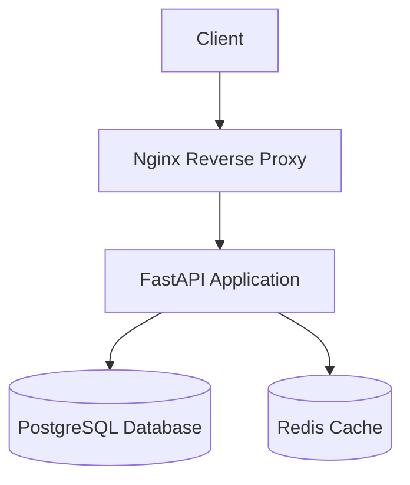

# Production-Ready Containerized Web App

A production-ready containerized web application built with FastAPI, PostgreSQL, Redis, and Nginx.

## Architecture



### Components

- **FastAPI**: Modern, fast web framework for building APIs
- **PostgreSQL**: Robust relational database
- **Redis**: In-memory data store for caching
- **Nginx**: High-performance reverse proxy and web server
- **Docker**: Containerization platform
- **Docker Compose**: Container orchestration

## Features

- Multi-stage Docker builds for optimized container size
- Alpine-based images for minimal footprint
- Security scanning with Trivy

## Prerequisites

- Docker
- Docker Compose
- Trivy (for security scanning)

## Getting Started

1. Clone the repository
2. Create a `.env` file based on `.env.example`
3. Run the application:

```bash
docker-compose up --build
```

## Accessing the Application

The application will be available at `http://localhost:80`.

Additionally, a reverse proxy is configured for the `my-test-app` domain.  
If you want to use this custom domain locally, add the following entry to your `/etc/hosts` file: `127.0.0.1 localhost my-test-app`

To edit the file:

```bash
sudo vim /etc/hosts
```

## Security Scan Results

There's results screens in "trivy-scan" directory, but if need to run it you can use:

```bash
trivy image <image-name>
```

## Development

- FastAPI application: `app/`
- Docker configuration: `Dockerfile`, `docker-compose.yml`
- Nginx configuration: `nginx/`
